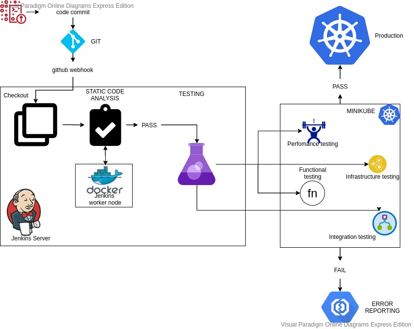

# DEPLOYING ELK STACK WITH FILEBEATS USING JENKINS AND K8S

This demo is intended to demonstrate the deployment of ELK stack with Filebeats to Kubernetes cluster using jenkins pipeline.
The architecture diagram is as shown below 

Here the [github repo](https://github.com/pravi1991/ci-cd.git)

Issue with kubernetes continuous deployment plugin
https://issues.jenkins-ci.org/browse/JENKINS-62995

docker overlay filesystem full
https://stackoverflow.com/questions/31712266/how-to-clean-up-docker-overlay-directory